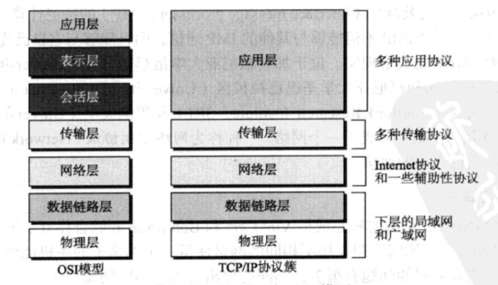

# 1.1 概览
## 1.1.1 网络
* 局域网（local area network， LAN）通常是私有的，连接一个办公室、大楼内的一些主机。一个宿舍打CS局域网就够用了。
* 广域网（wide area netwoek，WAN）覆盖范围比局域网大得多。一个北京市打CS就得用广域网了。
* 互联网 两个或多个网络连接形成。整个地球打CS就得来互联网了。
## 1.1.2 交换
* 电路交换网络 （circuit-switched network）两个端系统之间总是存在一条专用的链接，交换机只能使其变成活跃或者非活跃状态。电话就是电路交换网络，为了保证每个人打电话都是畅通的，所以电路容量很大但是利用率却很低。
* 分组交换网络 计算机网络中，两个端点之间使用被称为分组（packet）的数据块进行通信。
## 1.1.3 Internet
这一节感觉没有什么可记的，大概就是说了最牛逼的互联网叫因特网。因特网是分层的，主干（backbone）在最高层，通过成为对等点（peering point）一个复杂的交换系统连接，是一些牛逼的通信公司的大型网络。提供者网络（provider network）在第二层，他们的给主干交钱才能使用网络服务。客户网络（customer network）是Internet边缘的网络，他们得给提供者网络付费。说了这么多就是告诉我们网络不是白用的，得给钱！
## 1.1.4 访问Internet
这一节也没什么可记的，就是几种连接互联网的方法，拨号网络，DSL服务，无线网络，直接连接。
## 1.1.5 硬件和软件
这一节更没有什么可记，怀疑后三节是不是用来凑字数。。。
# 1.2 协议分层
## 1.2.1 场景
协议定义了发送者、接受者和所用中间设备为了高效通信需要遵守的规则。（这就是协议的定义，原来一直不明白协议是啥，直到看了这个，发现还是不明白）
* 协议分层的优势
将服务从实现中分离出来，一层需要能够接收较低层的一系列服务，同时向较高层提供服务，而我们不关心这一层是如何实现的。（说白了就是自己干好自己的事，只要结果，省的扯皮）
* 协议分层的原则
如果想要双向通信，那么我们需要每一层能够实现两个相反的任务，每个方向上一个。（没懂。。。先记下来吧）感觉就是每一层既可以向上传递也可以向下传递数据。
## 1.2.2 TCP/IP协议簇
5层模型：应用层、传输层、网络层、数据链镀层、物理层。

### TCP/IP协议簇各层描述
* 应用层
两个应用层之间的逻辑连接是端到端的。应用层的通信处于两个进程之间，一个进程向另一个进程发送请求，并且接受另一个进程的响应。交换的数据成为消息。
* 传输层
逻辑连接是端到端的，源主机的传出层从应用层得到消息，封装成传输层的分组（TCP中叫段，UDP中叫用户数据报）。TCP和UDP的区别是重点后面会说道。
* 网络层
负责在源计算机和目的计算机之间创建一个连接，网络层的通信是主机到主机的。（分组到了这里就叫做数据报）
* 数据链路层
传输分组（这个已经不再研究范围之内了）分组到了链路层就被叫做帧。
* 物理层
负责携带一个帧中单独的比特穿过链路。
### 总结一下
整个通信就像是淘宝买东西，卖家把宝贝一层一层包好写上地址叫个快递公司，快递公司送到我家，我在一层一层拆开。
### 封装和解封装
简单的来说自顶向下传输数据就叫封装，自下而上传输数据就叫解封装。
### 地址
话不多说直接上图吧

### 多路复用与多路分解
这个应该挺重要！！！
* 多路复用
一个协议能够封装来自多个上层协议的分组（一次一个）。
* 多路分解
一个协议能够解封装，并且将分组投递到多个上层协议（一次一个）。

## 1.2.3 OSI模型
ISO是一个组织，OSI是一个模型

之前看的是第五版比第六版少很多东西，这里补充一下。。。
## 1.4 分组交换网中的时延、丢包和吞吐量
这个在后面很多地方都会用到计算，第一遍读的时候就没搞明白。
### 1.4.1 时延
结点总时延（total nodal delay）= 结点处理时延（nodal processing delay） + 排队时延（queuing delay） + 传输时延（transmission delay） + 传播时延（propagation delay）
### 时延类型
当分组到达路由器时，路由器检查该分组的首部已决定该分组的是适当出链路，并将该分组导向该链路。
* 处理时延
检查分组首部和决定将该分组导向何处所需要的时间。
* 排队时延
在队列中，当分组在链路上等待传输的时间。
* 传输时延
L表示该分组的长度，R bps表示链路传输速率，传输时延是L/R。是路由器将分组推出的时间。
* 传播时延
从一个链路起点到另一个路由器的时间。与路由器之间的距离与传播介质有关。

## 接下来的小结
讲了一堆有的没的乱七八糟的东西，主要是Internet的发展和管理，不看也就不看了。。。