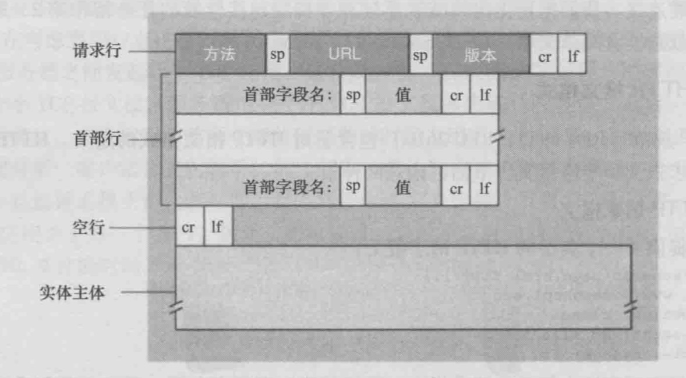
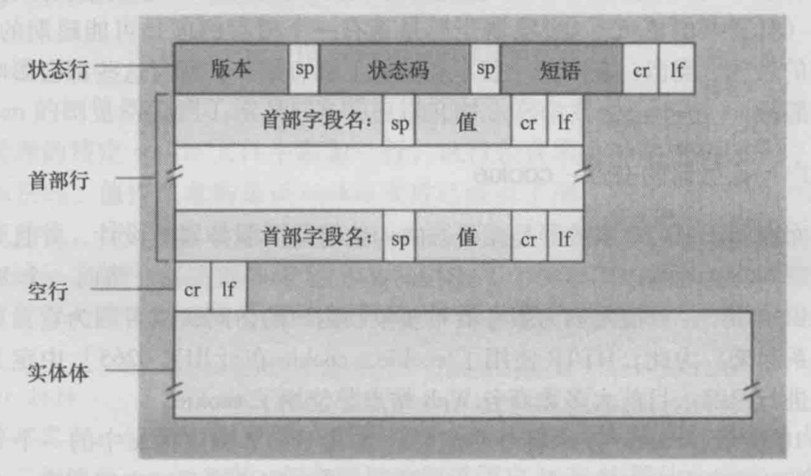

# 2 应用层
## 2.1 应用层协议管理
通过了分层开发者只需要关注应用层开发，而不用关心网络层是如何实现的，当然也没法改变网络层的实现方式。
### 2.1.1 网络应用体系结构
* 客户-服务器体系结构
* P2P体系结构
### 2.1.2 进程通信
在给定的一对进程之间的通信会话场景中，发起通信（即在该会话开始时发起与其他进程的联系）的进程被标识为**客户**，在会话开始时等待联系的进程是**服务器**。
### 2.1.3 可供应用程序使用的运输服务
从四个方面对应用程序服务要求进行分类：可靠数据传输，吞吐量，定时和安全性。
* 可靠数据传输
由应用程序一端发送的数据正确、完全的交付给给应用程序的另一缎。
* 吞吐量
这个就是看运输协议的运输能力怎么样，看个蓝光视频必须要有高速率支持，没有金刚钻就不能拦这瓷器活。。。
* 定时
一个保证的例子：发送方注入进套接字中的每个比特到达接收方的套接字不迟于100ms。
原来定时是这个意思，一直以为是固定时间发送呢。。。
* 安全性
加密有发送进程传输的所有数据，交付个接收进程前解密这些数据。
## 2.2 Web和HTTP
### 2.2.2 非持续连接和持续连接
* 非持续连接
每个TCP连接在服务器发送一个对象后关闭。
* 持续连接
相同的客户与服务器之间的后续请求和响应报文能够通过相同的连接进行传送。
* 往返时间（RTT）
一个短分组从客户到服务器然后再返回客户所花费的时间。
客户请求HTML基本文件起到该客户收到整个文件止所花费的时间，三次握手前两端占用1个RTT。三次握手第三部分发送HTTP请求，服务器在该连接上发送HTML占用另一个RTT。最后加上服务器传输HTML文件的时间。
### 2.2.3 HTTP报文格式
#### 1.HTTP请求报文

#### 2.HTTP响应报文
